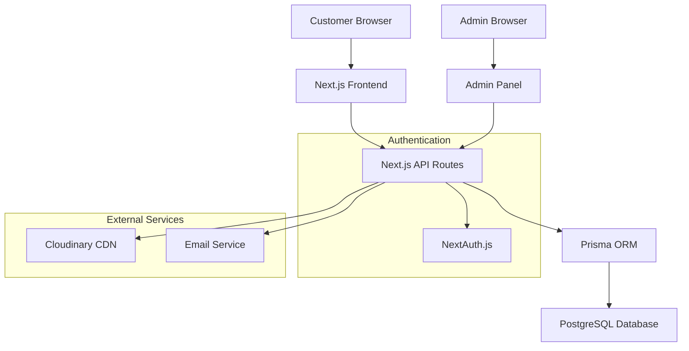
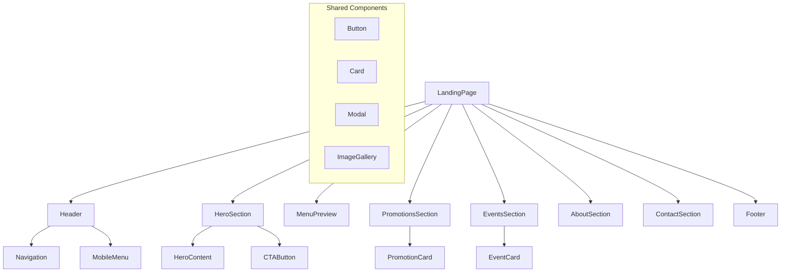
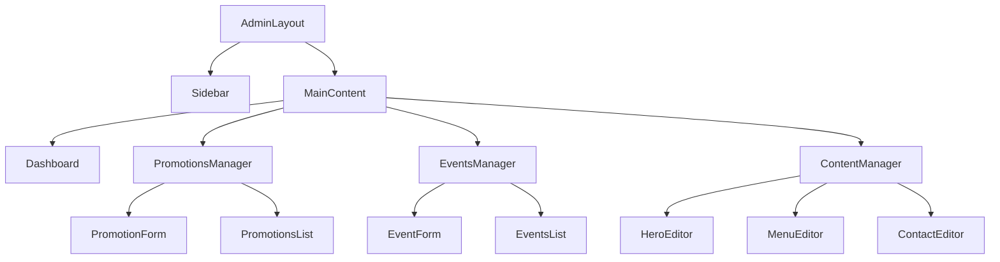
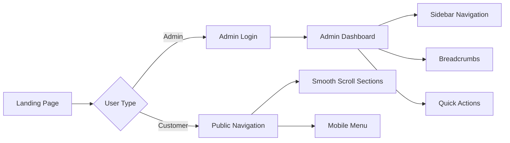
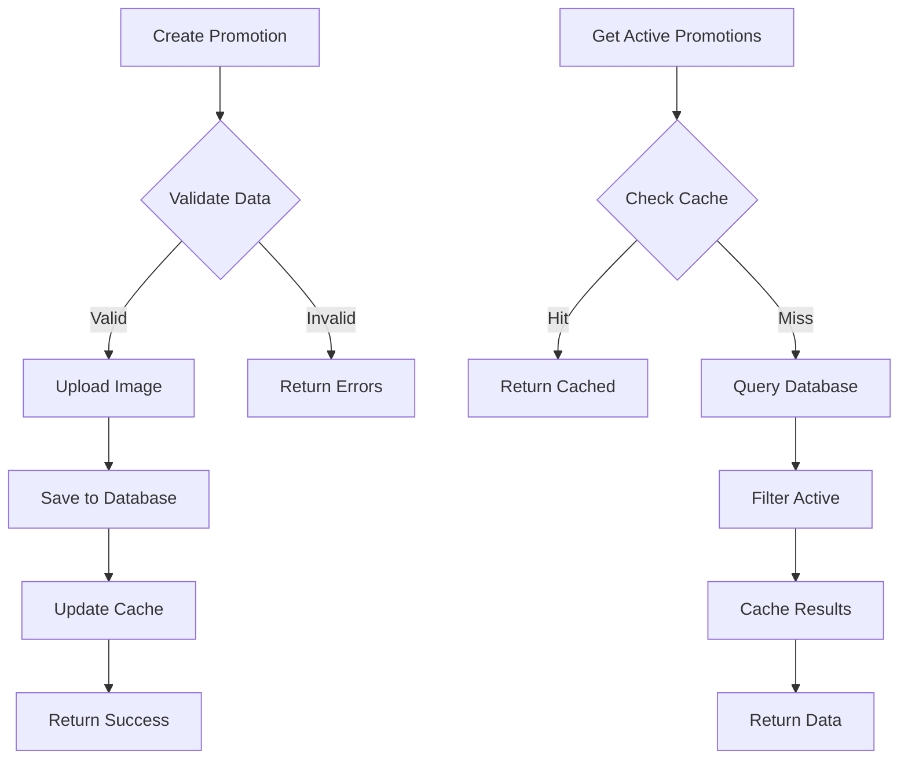
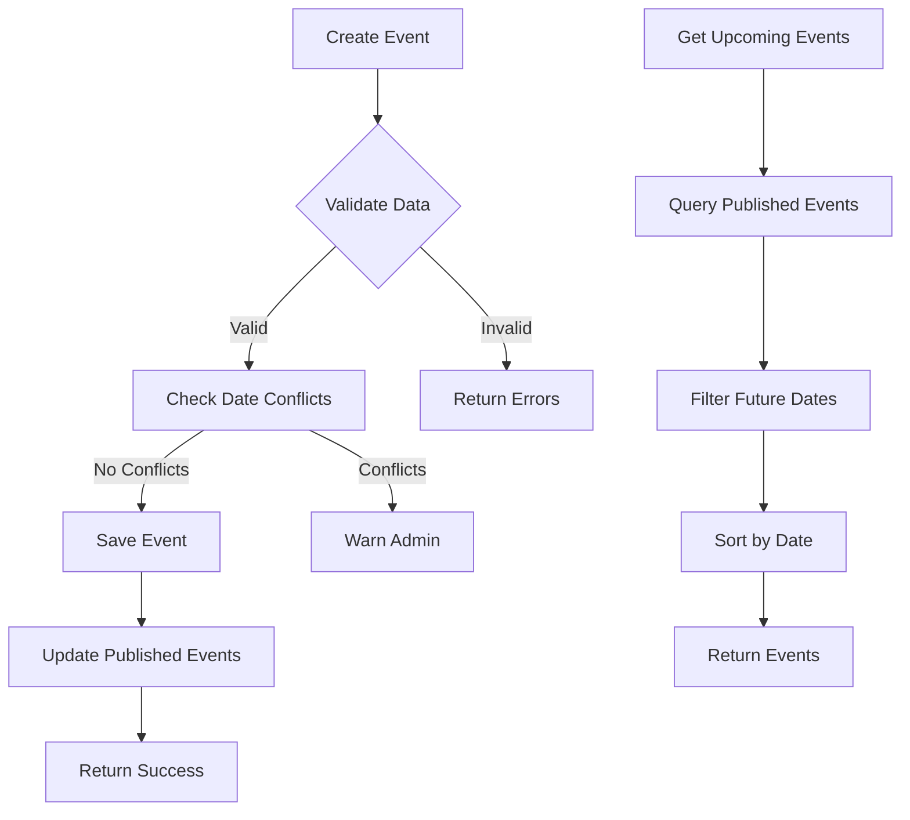
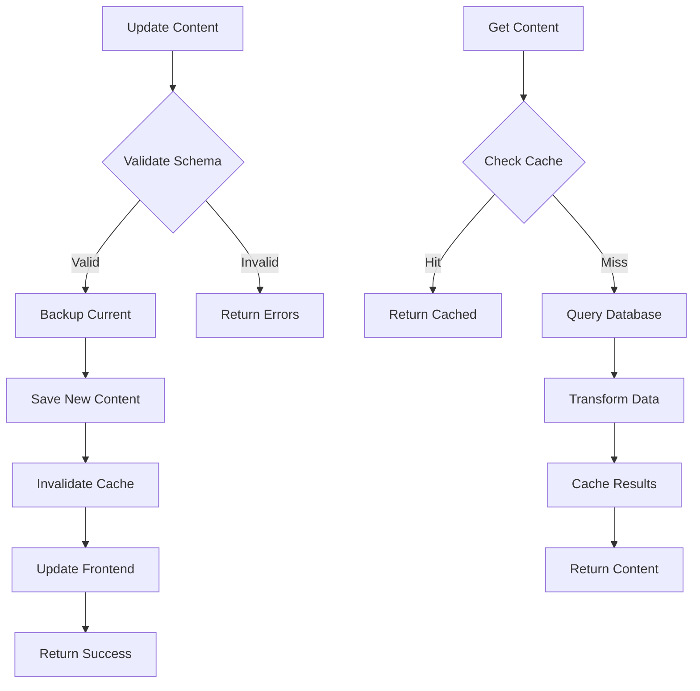

# Restaurant Landing Page Design Documentation

## Overview

A modern, responsive restaurant landing page with administrative capabilities for managing promotions, discounts, and events. The solution consists of a customer-facing landing page and an admin panel, both built with TypeScript for type safety and maintainability.

### Key Requirements
- Attractive, modern design
- Full mobile responsiveness
- Admin panel for content management
- TypeScript implementation
- Easy content updates for promotions/events

## Technology Stack & Dependencies

### Frontend Framework
- **React 18+** with TypeScript
- **Next.js 14** for SSR/SSG and routing
- **Tailwind CSS** for responsive design and styling
- **Framer Motion** for animations and interactions

### Backend & Database
- **Next.js API Routes** for backend functionality
- **Prisma ORM** with PostgreSQL for data management
- **NextAuth.js** for admin authentication
- **Cloudinary** for image management

### Development Tools
- **TypeScript 5+** for type safety
- **ESLint + Prettier** for code quality
- **Husky** for git hooks
- **Jest + React Testing Library** for testing

## Architecture

### System Architecture



### Application Structure

```
src/
├── components/
│   ├── ui/                    # Reusable UI components
│   ├── landing/               # Landing page components
│   └── admin/                 # Admin panel components
├── pages/
│   ├── api/                   # API endpoints
│   ├── admin/                 # Admin panel pages
│   └── index.tsx              # Landing page
├── lib/
│   ├── prisma.ts              # Database client
│   ├── auth.ts                # Authentication config
│   └── utils.ts               # Utility functions
├── types/                     # TypeScript type definitions
└── styles/                    # Global styles
```

## Component Architecture

### Landing Page Components

#### Component Hierarchy



#### Component Definitions

**HeroSection Component**
```typescript
interface HeroSectionProps {
  title: string;
  subtitle: string;
  backgroundImage: string;
  ctaText: string;
  ctaLink: string;
}
```

**PromotionCard Component**
```typescript
interface PromotionCardProps {
  id: string;
  title: string;
  description: string;
  discount: number;
  validUntil: Date;
  image?: string;
  isActive: boolean;
}
```

**EventCard Component**
```typescript
interface EventCardProps {
  id: string;
  title: string;
  description: string;
  date: Date;
  time: string;
  image?: string;
  capacity?: number;
  isPublished: boolean;
}
```

### Admin Panel Components

#### Admin Component Hierarchy



#### Admin Component Definitions

**PromotionForm Component**
```typescript
interface PromotionFormProps {
  promotion?: Promotion;
  onSubmit: (data: PromotionFormData) => Promise<void>;
  onCancel: () => void;
  isLoading: boolean;
}

interface PromotionFormData {
  title: string;
  description: string;
  discount: number;
  validFrom: Date;
  validUntil: Date;
  image?: File;
  isActive: boolean;
}
```

**EventForm Component**
```typescript
interface EventFormProps {
  event?: Event;
  onSubmit: (data: EventFormData) => Promise<void>;
  onCancel: () => void;
  isLoading: boolean;
}

interface EventFormData {
  title: string;
  description: string;
  date: Date;
  time: string;
  capacity?: number;
  image?: File;
  isPublished: boolean;
}
```

## Data Models & Database Schema

### Prisma Schema

```prisma
model Promotion {
  id          String   @id @default(cuid())
  title       String
  description String
  discount    Int
  validFrom   DateTime
  validUntil  DateTime
  image       String?
  isActive    Boolean  @default(true)
  createdAt   DateTime @default(now())
  updatedAt   DateTime @updatedAt
}

model Event {
  id          String   @id @default(cuid())
  title       String
  description String
  date        DateTime
  time        String
  capacity    Int?
  image       String?
  isPublished Boolean  @default(false)
  createdAt   DateTime @default(now())
  updatedAt   DateTime @updatedAt
}

model Content {
  id    String @id @default(cuid())
  key   String @unique
  value Json
  updatedAt DateTime @updatedAt
}

model User {
  id    String @id @default(cuid())
  email String @unique
  name  String?
  role  String @default("admin")
}
```

### TypeScript Type Definitions

```typescript
// Core Types
export interface Promotion {
  id: string;
  title: string;
  description: string;
  discount: number;
  validFrom: Date;
  validUntil: Date;
  image?: string;
  isActive: boolean;
  createdAt: Date;
  updatedAt: Date;
}

export interface Event {
  id: string;
  title: string;
  description: string;
  date: Date;
  time: string;
  capacity?: number;
  image?: string;
  isPublished: boolean;
  createdAt: Date;
  updatedAt: Date;
}

export interface RestaurantContent {
  hero: {
    title: string;
    subtitle: string;
    backgroundImage: string;
    ctaText: string;
  };
  about: {
    title: string;
    description: string;
    images: string[];
  };
  contact: {
    address: string;
    phone: string;
    email: string;
    hours: {
      [key: string]: string;
    };
  };
}
```

## API Endpoints Reference

### Public API Endpoints

| Endpoint | Method | Description | Response |
|----------|--------|-------------|----------|
| `/api/promotions` | GET | Get active promotions | `Promotion[]` |
| `/api/events` | GET | Get published events | `Event[]` |
| `/api/content` | GET | Get restaurant content | `RestaurantContent` |
| `/api/contact` | POST | Submit contact form | `{ success: boolean }` |

### Admin API Endpoints

| Endpoint | Method | Description | Auth Required |
|----------|--------|-------------|---------------|
| `/api/admin/promotions` | GET | Get all promotions | ✅ |
| `/api/admin/promotions` | POST | Create promotion | ✅ |
| `/api/admin/promotions/[id]` | PUT | Update promotion | ✅ |
| `/api/admin/promotions/[id]` | DELETE | Delete promotion | ✅ |
| `/api/admin/events` | GET | Get all events | ✅ |
| `/api/admin/events` | POST | Create event | ✅ |
| `/api/admin/events/[id]` | PUT | Update event | ✅ |
| `/api/admin/events/[id]` | DELETE | Delete event | ✅ |
| `/api/admin/content` | PUT | Update content | ✅ |
| `/api/admin/upload` | POST | Upload images | ✅ |

### Request/Response Schema

**Promotion Creation Request**
```typescript
{
  title: string;
  description: string;
  discount: number;
  validFrom: string; // ISO date
  validUntil: string; // ISO date
  image?: string; // URL after upload
  isActive: boolean;
}
```

**Event Creation Request**
```typescript
{
  title: string;
  description: string;
  date: string; // ISO date
  time: string; // HH:mm format
  capacity?: number;
  image?: string; // URL after upload
  isPublished: boolean;
}
```

### Authentication Requirements

- Admin panel requires authentication via NextAuth.js
- Session-based authentication with secure cookies
- Role-based access control (admin role required)
- Protected API routes with middleware validation

## Routing & Navigation

### Public Routes

```typescript
const publicRoutes = {
  home: '/',
  menu: '/#menu',
  promotions: '/#promotions',
  events: '/#events',
  about: '/#about',
  contact: '/#contact'
};
```

### Admin Routes

```typescript
const adminRoutes = {
  login: '/admin/login',
  dashboard: '/admin',
  promotions: '/admin/promotions',
  events: '/admin/events',
  content: '/admin/content',
  settings: '/admin/settings'
};
```

### Navigation Implementation



## Styling Strategy

### Tailwind CSS Configuration

```typescript
// tailwind.config.js
module.exports = {
  content: ['./src/**/*.{js,ts,jsx,tsx}'],
  theme: {
    extend: {
      colors: {
        primary: {
          50: '#fef7ee',
          500: '#f97316',
          900: '#9a3412'
        },
        secondary: {
          50: '#f8fafc',
          500: '#64748b',
          900: '#0f172a'
        }
      },
      fontFamily: {
        serif: ['Playfair Display', 'serif'],
        sans: ['Inter', 'sans-serif']
      }
    }
  },
  plugins: [require('@tailwindcss/forms')]
};
```

### Design System

| Component | Mobile | Tablet | Desktop |
|-----------|--------|--------|---------|
| Hero Section | Stack vertical | 2-column | 2-column |
| Menu Grid | 1 column | 2 columns | 3 columns |
| Promotions | Card stack | 2 columns | 3 columns |
| Events | List view | 2 columns | 2 columns |

### Responsive Breakpoints

```css
/* Mobile First Approach */
.container {
  @apply px-4;
}

@screen sm {
  .container {
    @apply px-6;
  }
}

@screen lg {
  .container {
    @apply px-8 max-w-6xl mx-auto;
  }
}
```

## Business Logic Layer

### Promotion Management



### Event Management



### Content Management



## State Management

### Client State with Zustand

```typescript
// Store for landing page
interface LandingStore {
  promotions: Promotion[];
  events: Event[];
  content: RestaurantContent;
  isLoading: boolean;
  error: string | null;
  
  // Actions
  fetchPromotions: () => Promise<void>;
  fetchEvents: () => Promise<void>;
  fetchContent: () => Promise<void>;
}

// Store for admin panel
interface AdminStore {
  promotions: Promotion[];
  events: Event[];
  isLoading: boolean;
  
  // Actions
  createPromotion: (data: PromotionFormData) => Promise<void>;
  updatePromotion: (id: string, data: PromotionFormData) => Promise<void>;
  deletePromotion: (id: string) => Promise<void>;
  createEvent: (data: EventFormData) => Promise<void>;
  updateEvent: (id: string, data: EventFormData) => Promise<void>;
  deleteEvent: (id: string) => Promise<void>;
}
```

### Server State with React Query

```typescript
// Custom hooks for data fetching
export const usePromotions = () => {
  return useQuery({
    queryKey: ['promotions'],
    queryFn: () => fetch('/api/promotions').then(res => res.json()),
    staleTime: 5 * 60 * 1000, // 5 minutes
  });
};

export const useEvents = () => {
  return useQuery({
    queryKey: ['events'],
    queryFn: () => fetch('/api/events').then(res => res.json()),
    staleTime: 5 * 60 * 1000,
  });
};

// Admin mutations
export const useCreatePromotion = () => {
  const queryClient = useQueryClient();
  
  return useMutation({
    mutationFn: (data: PromotionFormData) =>
      fetch('/api/admin/promotions', {
        method: 'POST',
        body: JSON.stringify(data),
      }),
    onSuccess: () => {
      queryClient.invalidateQueries({ queryKey: ['admin', 'promotions'] });
    },
  });
};
```

## Testing Strategy

### Unit Testing

```typescript
// Component testing example
describe('PromotionCard', () => {
  const mockPromotion: Promotion = {
    id: '1',
    title: 'Weekend Special',
    description: '20% off all main courses',
    discount: 20,
    validFrom: new Date(),
    validUntil: new Date(Date.now() + 7 * 24 * 60 * 60 * 1000),
    isActive: true,
    createdAt: new Date(),
    updatedAt: new Date(),
  };

  it('renders promotion details correctly', () => {
    render(<PromotionCard {...mockPromotion} />);
    
    expect(screen.getByText('Weekend Special')).toBeInTheDocument();
    expect(screen.getByText('20% off all main courses')).toBeInTheDocument();
    expect(screen.getByText('20% OFF')).toBeInTheDocument();
  });

  it('shows expiry date', () => {
    render(<PromotionCard {...mockPromotion} />);
    
    expect(screen.getByText(/valid until/i)).toBeInTheDocument();
  });
});
```

### API Testing

```typescript
// API route testing
describe('/api/admin/promotions', () => {
  it('creates a new promotion', async () => {
    const promotionData = {
      title: 'Test Promotion',
      description: 'Test description',
      discount: 15,
      validFrom: new Date().toISOString(),
      validUntil: new Date(Date.now() + 7 * 24 * 60 * 60 * 1000).toISOString(),
      isActive: true,
    };

    const response = await fetch('/api/admin/promotions', {
      method: 'POST',
      headers: { 'Content-Type': 'application/json' },
      body: JSON.stringify(promotionData),
    });

    expect(response.status).toBe(201);
    
    const result = await response.json();
    expect(result.title).toBe(promotionData.title);
  });
});
```

### End-to-End Testing

```typescript
// E2E testing with Playwright
test('admin can create and publish promotion', async ({ page }) => {
  // Login as admin
  await page.goto('/admin/login');
  await page.fill('[name="email"]', 'admin@restaurant.com');
  await page.fill('[name="password"]', 'password');
  await page.click('button[type="submit"]');

  // Navigate to promotions
  await page.click('text=Promotions');
  
  // Create new promotion
  await page.click('text=New Promotion');
  await page.fill('[name="title"]', 'Happy Hour Special');
  await page.fill('[name="description"]', '50% off drinks 4-6 PM');
  await page.fill('[name="discount"]', '50');
  
  // Set dates
  await page.fill('[name="validFrom"]', '2024-01-01');
  await page.fill('[name="validUntil"]', '2024-12-31');
  
  // Submit
  await page.click('button[type="submit"]');
  
  // Verify creation
  await expect(page.locator('text=Happy Hour Special')).toBeVisible();
  
  // Check on landing page
  await page.goto('/');
  await expect(page.locator('text=Happy Hour Special')).toBeVisible();
});
```